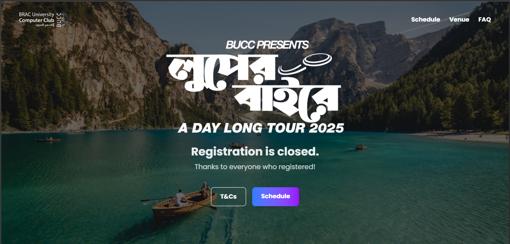
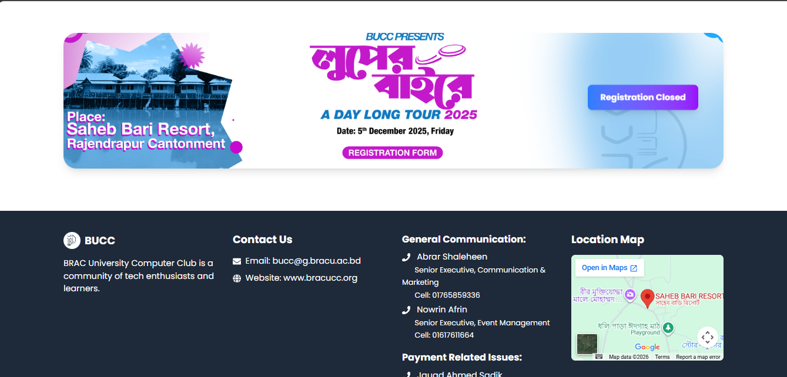

# 🏕️ Looperbaire | BUCC Tour Website

> The official tour and travel showcase platform for the BRAC University Computer Club (BUCC).

**Looperbaire** is a sleek, responsive website built to highlight upcoming club tours, share past trip galleries, and provide students with detailed itineraries and registration portals for BUCC adventures.

---

## 📸 Platform Gallery

<table>
<tr>
<td align="center">



<em>Home & Hero Section</em>
</td>
<td align="center">



<em>Footer</em>
</td>

</tr>
</table>

---

## 🚀 Tech Stack

This project is built using modern web standards to ensure a fast, SEO-friendly, and responsive experience across all devices.

* **Framework:** [Next.js](https://nextjs.org/) (React)
* **Styling:** Tailwind CSS (for rapid, responsive UI design)
* **Language:** JavaScript / TypeScript
* **Deployment:** Vercel (Recommended)

---

## ⚙️ Getting Started

Follow these steps to run the **Looperbaire** website on your local machine.

### 1. Clone the Repository

Open your terminal and clone this repository:

```bash
git clone https://github.com/your-username/looperbaire.git
cd looperbaire

```

### 2. Install Dependencies

Install all the required NPM packages:

```bash
npm install

```

### 3. Run the Development Server

Start the local Next.js server:

```bash
npm run dev

```

Open [http://localhost:3000](https://www.google.com/search?q=http://localhost:3000) with your browser to see the result. The page will auto-update as you edit the files.

---

## 📂 Project Structure

A quick look at the core folders to help you navigate the codebase:

* **`/app`** (or `/pages`): Contains the main routing, views, and core pages (Home, About, Itinerary).
* **`/components`**: Reusable UI elements (Navbar, Footer, TourCards, Buttons).
* **`/public`**: Static assets like logos, background images, and icons.
* **`/docs`**: Documentation assets, including the showcase screenshots.

---

## 🤝 Contributing

Are you a BUCC member looking to improve the site? Contributions, issues, and feature requests are welcome!

1. Fork the Project
2. Create your Feature Branch (`git checkout -b feature/AmazingFeature`)
3. Commit your Changes (`git commit -m 'Add some AmazingFeature'`)
4. Push to the Branch (`git push origin feature/AmazingFeature`)
5. Open a Pull Request

---

